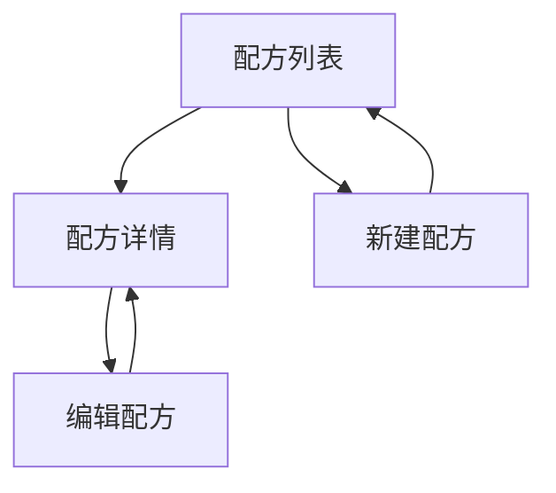

# 烘焙助手 PRD（精简版 v0.7）

> [!note]
> v1 只做一件事：配方的**增删改查（CRUD）**。数据先存本地；不做搜索/收藏/计时/日志/云同步。

## 1. 一句话定位

React Native 的离线个人配方本：把配方记下来，并在厨房里快速打开查看。

## 2. 目标（v1）

- 录入一条配方足够快（字段少、操作少）
- 查看一条配方足够清晰（用料与步骤分区、适合扫读）
- 本地可靠（关闭 App/重启后数据不丢）

## 3. 范围

### 3.1 v1 做什么（In Scope）

- 配方列表（本地）
- 新建配方
- 查看配方详情
- 编辑配方（最基本）
- 删除配方

### 3.2 v1 不做什么（Out of Scope）

- 登录/云同步/多端
- 搜索、标签、分类、收藏、分享、导入解析
- 份量换算/单位换算（单位不做选择；录入建议按克书写）
- 烘焙模式/计时/提醒
- 烘焙日志/复盘

## 4. 页面与流程（v1）



## 5. 功能需求（P0）

### 5.1 配方列表

- 展示：标题、更新时间
- 操作：进入详情、新建入口
- 排序：按更新时间倒序

### 5.2 配方详情

- 展示区块：用料、步骤、备注
- 操作：编辑、删除

### 5.3 新建/编辑配方（最基本）

- 必填：标题
- 选填：用料（结构化列表）、烘烤参数（可多段）、步骤（字符串数组）、要点提示（可多条）、备注（可选）
- 保存/取消
- 用料：单位以“克”为主；遇到“1 个/适量”等可写在备注里（克数留空）
- 步骤：字符串数组（每条一步），详情页按序号展示

### 5.4 本地存储

- 默认离线可用（不依赖网络）
- 状态管理：Zustand
- 持久化：Zustand `persist`（v1 直接把配方数据持久化到本地存储）
- 存储后端（React Native）：优先 `AsyncStorage`；后续如有性能/体积需求可替换为 MMKV

### 5.5 本地数据策略（v1）

- 只持久化配方业务数据（不持久化 UI 临时状态，如表单输入中间态、导航状态）
- 保留 `schemaVersion`（用于后续数据迁移），并预留迁移逻辑入口

## 6. 最小数据结构（建议）

### 6.1 Recipe
| 字段 | 类型 | 说明 |
|---|---|---|
| id | string | 唯一标识 |
| title | string | 标题 |
| ingredients[] | Ingredient | 用料（结构化） |
| bake | BakeSetting \| null | 烘烤参数（可空，可多段） |
| steps[] | string | 步骤（字符串数组） |
| tips[] | string | 提示要点（可空） |
| notes | string | 备注（可空） |
| createdAt/updatedAt | datetime | 创建/更新时间 |
| schemaVersion | number | 数据版本（迁移用） |

### 6.2 Ingredient
| 字段 | 类型 | 说明 |
|---|---|---|
| name | string | 材料名（如“高筋面粉”） |
| grams | number \| null | 克数（可空；如“鸡蛋 1 个”） |
| note | string | 补充（如“1 个”“适量”“室温”） |

### 6.3 BakeSetting（多段烘烤）
| 字段 | 类型 | 说明 |
|---|---|---|
| stages[] | BakeStage | 多段烘烤列表（顺序执行） |
| notes | string | 烤箱/模具/位置等补充（可空） |

### 6.4 BakeStage
| 字段 | 类型 | 说明 |
|---|---|---|
| type | string | 阶段类型：preheat/bake/rest/other |
| topC | number \| null | 上火温度（℃） |
| bottomC | number \| null | 下火温度（℃） |
| minutes | number \| null | 时长（分钟） |
| mode | string | 模式（如“上下火/热风/蒸汽”） |
| note | string | 阶段备注（如“中层”“上色加盖锡纸”） |

### 6.5 示例（可直接本地存 JSON）
```json
{
  "id": "r_001",
  "title": "基础吐司",
  "ingredients": [
    { "name": "高筋面粉", "grams": 250, "note": "" },
    { "name": "清水", "grams": 160, "note": "常温" },
    { "name": "盐", "grams": null, "note": "3g 或适量" }
  ],
  "bake": {
    "stages": [
      { "type": "preheat", "topC": 180, "bottomC": 180, "minutes": 10, "mode": "上下火", "note": "" },
      { "type": "bake", "topC": 180, "bottomC": 170, "minutes": 20, "mode": "上下火", "note": "中层" },
      { "type": "bake", "topC": 160, "bottomC": 160, "minutes": 10, "mode": "热风", "note": "上色快可加盖锡纸" }
    ],
    "notes": "不同烤箱温差大，首次可少量测试"
  },
  "steps": [
    "混合材料，揉至扩展阶段",
    "一发至 2 倍大",
    "整形入模二发",
    "入炉烘烤"
  ],
  "tips": ["面团温度过高会影响出筋", "二发不足易塌陷"],
  "notes": "",
  "createdAt": "2026-01-27T00:00:00.000Z",
  "updatedAt": "2026-01-27T00:00:00.000Z",
  "schemaVersion": 1
}
```

## 7. 验收标准（v1）

- 能新建一条配方并在列表中看到；进入详情查看信息正确
- 能编辑配方并保存；返回详情后内容更新
- 能删除配方并从列表移除
- 退出/重启 App 后，本地配方仍可正常查看与编辑

## 8. 变更记录

| 版本 | 日期 | 变更 |
|---|---|---|
| v0.1 | 2026-01-27 | 初稿（烘焙模式/计时/日志方向） |
| v0.2 | 2026-01-27 | 调整为 RN 个人配方库（收敛范围） |
| v0.3 | 2026-01-27 | 进一步精简为“录入+查看+最基本编辑”，本地存储优先 |
| v0.4 | 2026-01-27 | 明确 v1 为 CRUD（增删改查） |
| v0.5 | 2026-01-27 | 数据结构细化：用料结构化 + 多段烘烤 + 步骤纯文本 |
| v0.6 | 2026-01-27 | 步骤改为字符串数组（steps[]） |
| v0.7 | 2026-01-27 | 明确技术选型：Zustand + persist（本地存储） |
